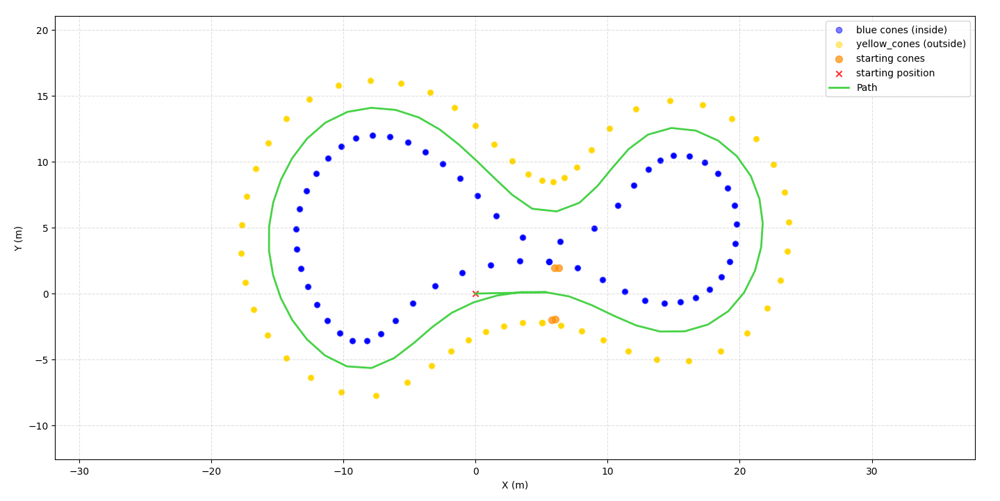

# TLS'e Racing Hackathon - Path Planning Module

  
   
  <em>(Example of a simple trajectory computed with a baseline path planning module)</em>

---

## Objectives & Approaches 

The goal of this challenge is to design an autonomous **Path Planning** pipeline capable of guiding a Formula Student Driverless (FSD) car around a closed track demarcated by cones.

---

## Provided Codebase vs. Your Work

### 1. Provided Components
* **`Track` (`src/track.py`)**: Loads track data directly from standard CSV files (`tag, x, y`). It automatically categorizes cones into `blue_cones`, `yellow_cones`, and `orange_cones`, while defining the vehicle starting pose `car_start`.
* **`Visualizer` (`src/visualizer.py`)**: Renders the cones (blue on the inside, yellow on the outside, orange for the starting line), the starting pose, and any computed path (`path: np.ndarray` or list of coordinates).
* **`PathPlanner` skeleton (`src/planner.py`)**: The structure of the class is given, **but the trajectory computation logic is left empty**. It is your job to implement an effective path planning algorithm.

### 2. What You Must Implement in `planner.py`
You need to develop the path computation pipeline inside `PathPlanner`:
* **Trajectory Generation:** Given the track boundary cones and vehicle starting pose, compute an ordered sequence of 2D waypoints that safely navigates through the circuit without crossing boundary limits.
* **Path Smoothing:** Raw discrete waypoints create piecewise-linear, discontinuous paths. You are encouraged to implement smoothing methods to ensure continuous curvature ($C^2$) and feasible steering commands.

---

## Development Options & Creative Paths

You have full freedom in how you tackle the challenge. Choose the approach that best fits your goals and team ambitions:

### 1. Work From the Baseline or Build from Scratch
* **Option A — Simple Geometric Approach:** Start with the provided skeleton in `planner.py` and implement a geometric heuristic (e.g., nearest-neighbor boundary pairing, sequential ordering).
* **Option B — Advanced Architecture:** Implement an advanced method from the literature (e.g., filtered Delaunay triangulation, Voronoi diagram, or constrained graph search).

### 2. Bonus & Advanced Challenges
If your core trajectory generator works smoothly, you can explore higher-level racing logic:

* **Local Horizon / Sensor Simulation (e.g., 5-cone preview):**
  Instead of feeding the entire track to your planner at once, simulate onboard perception by restricting the vehicle's visibility to a limited forward horizon:
  * Feed only the next **$N$ closest cones** ahead of the car (e.g., a window of 5 to 8 cones) or cones within a bounded radius and angular field of view.
  * Plan local paths iteratively as the vehicle moves forward.

* **Incremental Discovery $\to$ Global Optimization Pipeline:**
  * **Phase 1 (Discovery Lap):** Traverse the unknown circuit with your local reactive planner while accumulating observed cones into a global map.
  * **Phase 2 (Loop Closure):** Detect when the vehicle returns to the starting gate (using the orange start cones or distance to `car_start`).
  * **Phase 3 (Global Racing Line):** Once the full circuit is mapped, compute an optimized closed-loop trajectory ready for maximum-performance hot laps.

* **Dynamic Animation ($f(t)$):**
  Go beyond static plots with `visualizer.py`:
  * Create a time-series animation showing the track being unveiled step-by-step.
  * Display the vehicle moving along the circuit, its live local trajectory, and the final global path dynamically locking in once the lap is completed.

---

## Track Datasets

Your algorithm will be tested on several CSV circuits loaded via `Track(csv_path)`:
* **Nominal Tracks:** Clean, structured circuits with uniform cone distribution and clean boundaries.
* **Noisy / Complex Tracks:** Realistic, degraded tracks featuring:
  * Perturbed cone locations (simulating sensor noise).
  * Uneven cone counts between left and right boundaries (where simple indexing fails).
  * Missing cones in turns or isolated outliers.

---

## General Guidelines

1. **Input Data Usage:**
   * Your planner receives an instance of `Track`. Use `track.blue_cones`, `track.yellow_cones`, and `track.orange_cones` to build your boundaries.
   * The start line is defined by `track.car_start` and the orange cones. Make sure your generated path starts at or near the vehicle pose and follows the circuit orientation.
2. **Path Constraints & Safety:**
   * The generated path must stay strictly within the track limits.
   * Avoid sudden direction reversals or self-intersecting loops.

---

## Resources

Here are reference papers and video links to guide your implementation:

### 1. Key Research Papers
* **Track Boundary Extraction & Graph Search:**
  * *Kabzan et al. (AMZ Racing, 2020)* — *« AMZ Driverless: The Full Autonomous Racing System »* (*Journal of Field Robotics*): Classic FSD pipeline using Delaunay triangulation to extract midlines from cone positions.
  * *Szőnyi & Ignéczi (2024)* — *« Innovative Cone Clustering and Path Planning for Autonomous Formula Student Race Cars Using Cameras »*.
* **Path Smoothing & Racing Line Optimization:**
  * *Ravankar et al. (2018)* — *« Path Smoothing Techniques in Robot Navigation: State-of-the-Art, Current and Future Challenges »*.

### 2. Code Repositories & Implementations
* **[AtsushiSakai / PythonRobotics](https://github.com/AtsushiSakai/PythonRobotics)**
* **[TUMFTM / global_racetrajectory_optimization](https://github.com/TUMFTM/global_racetrajectory_optimization)**

### 3. Videos
* **[What Is Autonomous Navigation?](https://fr.mathworks.com/videos/autonomous-navigation-part-1-what-is-autonomous-navigation-1592993748308.html?s_tid=vid_pers_recs_nonen)**
* **[Path Planning with A* and RRT](https://fr.mathworks.com/videos/autonomous-navigation-part-4-path-planning-with-a-and-rrt-1594987710455.html)**
* **[Everything You Need to Know About Control Theory (can be helpful)](http://www.youtube.com/watch?v=lBC1nEq0_nk)**